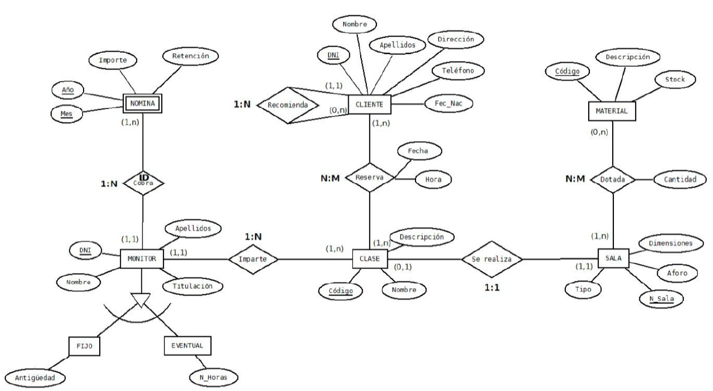

# Enunciado de la tarea

La hamburguesería  "BURGUERS PREMIUMS" quiere desarrollar una aplicación informática para gestionar los empleados, pedidos y repartos a domicilio de sus productos, así como para obtener estadísticas de los mismos. Se quiere registrar la siguiente información:

El establecimiento ofrece una serie de productos (hamburguesa simple, doble, alemana, coca-cola pequeña, mediana, grande, ensalada, etc.). También como productos dispone de menús que a su vez están formados por un conjunto de productos.  Cada producto viene identificado por un código y también tiene un nombre y un precio.

Todos los pedidos van numerados correlativamente y por cada uno de ellos se recoge la fecha y el importe total del pedido. Un pedido puede constar de varios productos en diferentes cantidades.

Los pedidos pueden ser de ventanilla (para consumir en el establecimiento) o de entrega a domicilio (se piden por teléfono). En el primer caso se registra el nº de ventanilla y en el segundo caso se guarda el nombre del cliente, el teléfono, la dirección y población.
Tanto para tomar nota de los pedidos como para prepararlos, la hamburguesería cuenta con una serie de empleados. De cada empleado se quiere guardar su DNI, Número de Seguridad Social, nombre completo, turno de trabajo (mañana, tarde, noche) y salario. Además, interesa conocer para cada pedido qué empleado ha tomado nota y qué empleado lo prepara. Cuando un empleado toma nota de un pedido se almacena la hora de creación y cuando un empleado lo prepara se registra la hora de finalización del pedido.

Por otra parte, para el reparto de los pedidos a domicilio también se cuenta con una serie de repartidores. Cada pedido se asigna a un único repartidor.  De cada repartidor se conoce su DNI, nombre completo, turno de trabajo e incentivo.  Cada repartidor registrará la hora de entrega de cada pedido que tenga asignado.

La hamburguesería dispone de varias motos para el reparto de los pedidos a domicilio. Las motos están numeradas de forma correlativa y además se guarda la matrícula, marca, modelo, cilindrada y año. Cada repartidor tendrá asignada una única moto que será la que utilice para realizar los repartos.  Una misma moto podrá ser utilizada por varios repartidores.

## Ejercicio 1
Elabora el diagrama Entidad-Relación. Para ello:
1. Identifica las entidades, atributos y relaciones.
2. Identifica las claves candidatas y determina la clave primaria.
3. Estudia las cardinalidades de entidades y cardinalidades de relaciones.
4. Identifica otros elementos del modelo ER Extendido.
5. Representa el diagrama E-R

## Ejercicio 2
A partir del siguiente diagrama, realiza los siguientes puntos:
1. El paso a tablas de entidades y sus atributos.
2. El paso a tablas de los elementos del diagrama Entidad Relación Extendido
3. El paso a tablas de las relaciones y posibles atributos.
4. Representa el modelo relacional

### Diagrama E-R
