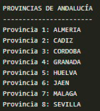

# 1.1 Ejercicio: Provincias de Andalucía

Crea un programa en Java que defina un enumerado con los nombres de 
las provincias de la comunidad autónoma de Andalucía para, posteriormente,
mostrar por pantalla cada valor del enumerado declarado.

La salida por pantalla deberá ser algo así:

## Tipos *enumerados*

Los tipos de datos enumerados permiten una forma de declarar una variable
con un conjunto restringido de valores (Días de la semana, meses, estaciones del año).

Para su declaración, se utiliza la palabra reservada `enum`, seguida del nombre
de la variable y la lista de valores que va a tomar entre `{}`

Los valores que se colocan dentro de las llaves se les consideran constantes, van
separados por comas y deben ser valores únicos.

La lista de valores se coloca entre llaves, porque un tipo de datos enum no es otra cosa que una
especie de clase en Java, y todas las clases llevan su contenido entre llaves.

Al considerar Java este tipo de datos como si de una clase se tratara, no solamente podemos definir los valores de un tipo
enumerado, sino que también podemos definir operaciones a realizar con él y otro tipo de elementos, lo que hace que este tipo
de dato sea más versátil y potente que en otros lenguajes de programación.

